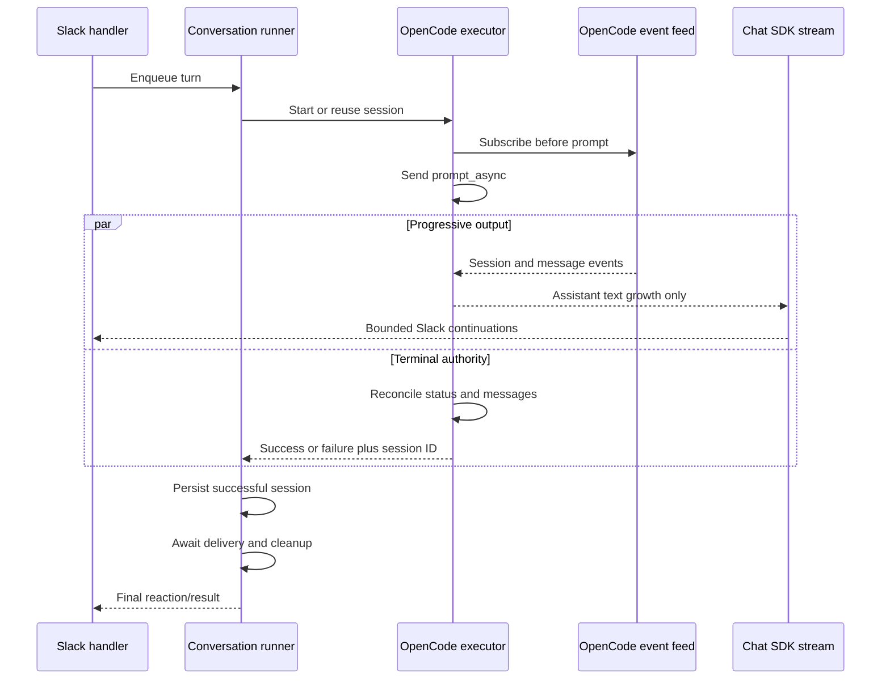

# Stream Local OpenCode Replies Into Slack - Plan

## Goal Capsule

- **Objective:** People see every assistant-visible section in the originating Slack thread while a local OpenCode turn is still running.
- **Means:** Stream the persistent `opencode serve` event feed through Chat SDK while retaining session status and messages as the terminal authority (KTD1, KTD2).
- **Authority:** STU-557 defines behavior; the current `opencode serve` architecture on `main` defines the runtime boundary; this plan defines implementation sequencing.
- **Stop conditions:** Stop if OpenCode v1 cannot associate streamed text with the target session and assistant message, or if Chat SDK 4.38.1 cannot start a stream without a visible placeholder.
- **Execution profile:** Keep the change local to Socket Mode and prove concurrency, failure, cleanup, and package behavior before real-Slack verification.
- **Tail ownership:** The implementer owns automated tests and package smoke checks; release verification owns native Slack streaming and fallback checks.

## Product Contract

### Summary

Local Socket Mode will stream bounded assistant-visible OpenCode output into Slack from the persistent server event feed, then reconcile the stream with the completed session transcript before releasing the conversation queue.

### Problem Frame

Local Pipa currently waits for `opencode serve` to become idle and then posts only the final assistant message.
Long-running turns therefore appear silent, and a turn with multiple assistant text sections can lose earlier visible work because completion reads only the latest message.

### Requirements

**Visible output**

- R1. The first assistant-visible text appears in the originating Slack thread before the OpenCode session reaches its terminal idle state.
- R2. Every assistant-visible text section for the current turn appears exactly once and in order.
- R3. Tool, reasoning, step, diagnostic, secret, and raw server-event content never appears in Slack.
- R4. Long output continues across ordered Slack messages with at most 3,500 characters in each logical response segment.

**Completion and failure**

- R5. Session status and the completed OpenCode transcript remain authoritative for terminal success, failure, and final text reconciliation.
- R6. A failure before visible output creates no streaming placeholder and uses the existing sanitized failure reply.
- R7. A failure after partial output preserves that output and adds exactly one sanitized incomplete-response notice instead of a second failure reply.
- R8. Successful OpenCode session IDs persist even when Slack delivery fails.

**Lifecycle and compatibility**

- R9. Same-thread turns wait for execution, persistence, delivery, and attachment cleanup; different Slack threads can continue concurrently.
- R10. Session continuity, stale-session replacement, attachments, timeouts, output bounds, `stopAll()`, and shutdown retain their current behavior.
- R11. The change adds no dependency, direct Slack API integration, Managed or Fly behavior, or Slack scope.
- R12. Node 22 tests and the packed install pass on Linux, macOS, and Windows.

### Key Decisions

- **Use the current persistent OpenCode server.** (session-settled: user-directed — chosen over restoring per-turn `opencode run --format json`: `main` now owns one reusable `opencode serve` process.) Governs R1-R12.

### Acceptance Examples

- AE1. **Covers R1-R3.** Given a turn emits two assistant text sections around tool activity, when the first section completes, then Slack shows it before session idle and later shows the second section without exposing tool or reasoning events.
- AE2. **Covers R2, R4.** Given assistant output crosses one or more 3,500-character boundaries, when streaming completes, then the ordered Slack messages reconstruct the final assistant-visible transcript without loss or duplication.
- AE3. **Covers R6.** Given OpenCode fails before assistant text, when the turn settles, then Slack contains the sanitized failure reply and no streaming placeholder.
- AE4. **Covers R7.** Given OpenCode fails after assistant text, when the turn settles, then Slack retains the partial text followed by one incomplete-response notice.
- AE5. **Covers R8-R10.** Given Slack delivery fails while OpenCode succeeds, when the turn settles, then OpenCode continues independently, the successful session ID persists, cleanup finishes, and a same-thread follow-up does not deadlock.

### Scope Boundaries

- Socket Mode only; Managed Mode continues to own a server without Slack.
- Stream assistant text only; tool-progress cards and interactive OpenCode questions are deferred.
- Keep Chat SDK as the sole Slack delivery boundary.

### Sources

- [STU-557](https://linear.app/lunchpaillabs/issue/STU-557)
- `src/app.mjs` for Slack handlers, conversation queueing, delivery, and reaction lifecycle.
- `src/opencode.mjs` for persistent server selection, sessions, prompts, status polling, attachments, and shutdown.
- `test/app.test.mjs` and `test/opencode.test.mjs` for current behavioral contracts.
- `package.json` for Node 22 and Chat SDK 4.38.1 constraints.

## Planning Contract

### Key Technical Decisions

- KTD1. **Keep `opencode serve` as the execution boundary.** Subscribe to its authenticated `/event` SSE feed before `prompt_async`; do not reintroduce per-turn child processes or NDJSON parsing. Implements the session-settled decision governing R1-R12.
- KTD2. **Treat events as progressive hints and server state as authority.** Filter events to the selected session and new assistant messages, emit only text growth, and reconcile against all new completed assistant text after terminal status so missed or repeated events cannot lose or duplicate output.
- KTD3. **Separate output consumption from terminal completion.** A turn exposes an assistant-text async iterable and a completion result. Event draining and OpenCode supervision continue when Slack is slow or fails, within the existing total output bound.
- KTD4. **Let Chat SDK own Slack streaming.** Pass bounded `AsyncIterable<string>` segments to `thread.post()` and configure fallback streaming with no placeholder. Do not call Slack streaming or edit APIs directly.
- KTD5. **Preserve queue authority in the runner.** A conversation tail releases only after the OpenCode result settles, a successful session is persisted, Slack delivery settles, and attachment/event cleanup finishes. Delivery failure must not prevent execution settlement or persistence.

### High-Level Technical Design

### Implementation Constraints

- Parse SSE incrementally across arbitrary byte boundaries, CRLF or LF delimiters, comments, and multi-line `data:` fields.
- Accept the OpenCode v1 event variants already present in the workspace: text deltas when supplied and cumulative text-part updates otherwise.
- Associate text parts with assistant message IDs from message metadata; never infer visibility from part type alone.
- Record emitted text per message and part so duplicate or cumulative updates yield only unseen suffixes.
- Reconcile the final ordered assistant text with emitted state before closing output.
- Do not let Slack backpressure stop the event reader or OpenCode terminal reconciliation.

### Sequencing

U1 defines the server-side turn stream and terminal result.
U2 integrates that contract with queueing and bounded Chat SDK delivery.
U3 updates operator documentation and verifies the packed and real-Slack behavior.

## Implementation Units

### U1. Expose progressive OpenCode server output

- **Goal:** Return assistant text progressively while retaining an independent authoritative completion result.
- **Requirements:** R1-R3, R5, R7, R10.
- **Dependencies:** None.
- **Files:** `src/opencode.mjs`, `test/opencode.test.mjs`.
- **Approach:**
  1. Add an authenticated, abortable SSE request using the same base URL, directory, and server credentials as other OpenCode requests.
  2. Establish or validate the session and capture the pre-turn message baseline before subscribing and sending `prompt_async`.
  3. Drain matching server events into a bounded assistant-text output channel while status and message requests determine terminal state.
  4. Track assistant message and text-part identities, normalize delta and cumulative update variants, and suppress non-text or non-assistant events.
  5. On terminal state, fetch all new messages, reconcile unseen assistant text in order, close output, and settle the completion result.
  6. Ensure timeout, overflow, network loss, `stopAll()`, and cleanup settle both output and completion exactly once.
- **Patterns to follow:** Existing `request()` authentication, `AbortController` lifecycle, `latestAssistantMessage()` filtering intent, attachment `finally` cleanup, and `delay()` cancellation.
- **Test scenarios:**
  - Covers AE1. Two assistant text parts separated by reasoning and tool events stream in order before idle; only text reaches the consumer.
  - Repeated cumulative updates and duplicate SSE events emit only unseen text.
  - A delta event split across byte chunks and a multi-line SSE event parse without loss.
  - An event missed before disconnect is restored once by final transcript reconciliation.
  - Events for another session or a pre-existing assistant message are ignored.
  - Stale persisted sessions still switch to a new session before streaming starts.
  - Timeout, output overflow, server error, network loss, and `stopAll()` close the output iterator and reject completion without hanging.
  - Attachment files remain readable through prompting and are removed only after execution and stream cleanup settle.
- **Verification:** Tests prove first output precedes terminal completion, final streamed text equals the new assistant transcript, and every active controller and temporary file settles on all terminal paths.

### U2. Stream bounded continuations through the conversation queue

- **Goal:** Deliver the OpenCode output channel through Chat SDK without weakening persistence or per-thread ordering.
- **Requirements:** R4, R6-R10.
- **Dependencies:** U1.
- **Files:** `src/app.mjs`, `test/app.test.mjs`.
- **Approach:**
  1. Configure Chat SDK fallback streaming to wait for the first real chunk instead of posting a placeholder.
  2. Start delivery from the turn output channel before terminal completion and partition it into ordered streams capped at 3,500 characters.
  3. Let OpenCode completion and persistence continue if any `thread.post()` stream fails; drain or discard remaining output without blocking the producer.
  4. Persist a successful session before the conversation tail can release, then await delivery and cleanup before starting the next same-thread turn.
  5. Route pre-output execution failures through the existing sanitized failure reply. Append one sanitized incomplete marker to partial output and suppress the second failure reply.
  6. Keep the warning/check reaction tied to the combined execution and delivery result.
- **Patterns to follow:** Existing `createConversationRunner()` tails, `safeError()`, `finishReaction()`, and 3,500-character `postInChunks()` budget; Chat SDK 4.38.1 `thread.post(AsyncIterable)` support.
- **Test scenarios:**
  - Covers AE2. Output crossing one and multiple continuation boundaries reconstructs exactly and each posted stream stays within 3,500 characters.
  - Covers AE3. Failure before the first chunk posts no placeholder and produces one sanitized failure reply.
  - Covers AE4. Failure after partial text retains the text, adds one incomplete marker, and does not add a second failure reply.
  - Covers AE5. Slack rejects the first or later stream while OpenCode succeeds; the session persists, output drains, cleanup completes, and the next same-thread turn starts.
  - A same-thread follow-up waits for persistence, delivery, and cleanup while another thread streams concurrently.
  - Shutdown during active streaming closes queued work and returns within the configured deadline.
  - Native-stream and fallback-shaped test doubles consume the same async iterable contract without direct Slack calls.
- **Verification:** Runner event ordering proves execution and delivery overlap safely while persistence, cleanup, and same-thread serialization remain ordered.

### U3. Document and release-check server streaming

- **Goal:** Make the new Socket Mode behavior and its release evidence explicit without changing Managed Mode.
- **Requirements:** R11, R12.
- **Dependencies:** U1, U2.
- **Files:** `README.md`, `docs/repository-overview.md`, `scripts/pack-smoke.mjs`.
- **Approach:** Update the request-flow documentation from final-response polling to progressive server-event delivery plus terminal reconciliation. Extend the packed smoke only where needed to prove the shipped runtime exposes the new turn contract; retain the existing Managed server smoke.
- **Patterns to follow:** Current concise README language, file-by-file repository overview, and temporary packed-install harness.
- **Test scenarios:**
  - The packed artifact loads the progressive executor contract from `src/opencode.mjs`.
  - Managed Mode still starts one inherited-environment `opencode serve` child and never requires Slack credentials.
  - A real Slack mention shows the first assistant text before session idle using native streaming.
  - A real Slack run without native stream context uses Chat SDK post-and-edit fallback with no placeholder.
- **Verification:** `npm test` and `npm run test:pack` pass under Node 22; CI passes on Linux, macOS, and Windows; native and fallback Slack checks preserve ordering and final text.

## Verification Contract

| Check | Covers | Done signal |
|---|---|---|
| `npm test` | U1, U2 | Server events, reconciliation, concurrency, failures, cleanup, and shutdown tests pass. |
| `npm run test:pack` | U3 | The packed CLI loads the progressive runtime and preserves Managed startup behavior. |
| CI operating-system matrix | R12 | Node 22 jobs pass on Linux, macOS, and Windows. |
| Real Slack native-stream check | R1-R4 | First text arrives before idle and final Slack text matches the completed OpenCode transcript. |
| Real Slack fallback check | R4, R6-R7 | Post-and-edit fallback has no placeholder, preserves continuations, and marks partial failure once. |

## Definition of Done

- U1-U3 satisfy their verification outcomes.
- Every acceptance example has automated coverage except the two explicitly real-Slack checks.
- Successful session persistence is proven independent of Slack delivery success.
- No assistant text is duplicated or omitted when events repeat, disconnect, or arrive cumulatively.
- No non-text OpenCode event content reaches Slack.
- Socket Mode documentation describes progressive delivery and terminal reconciliation; Managed Mode behavior remains unchanged.
- No new dependency, Slack scope, direct Slack API call, Fly path, or abandoned experimental code remains in the diff.
